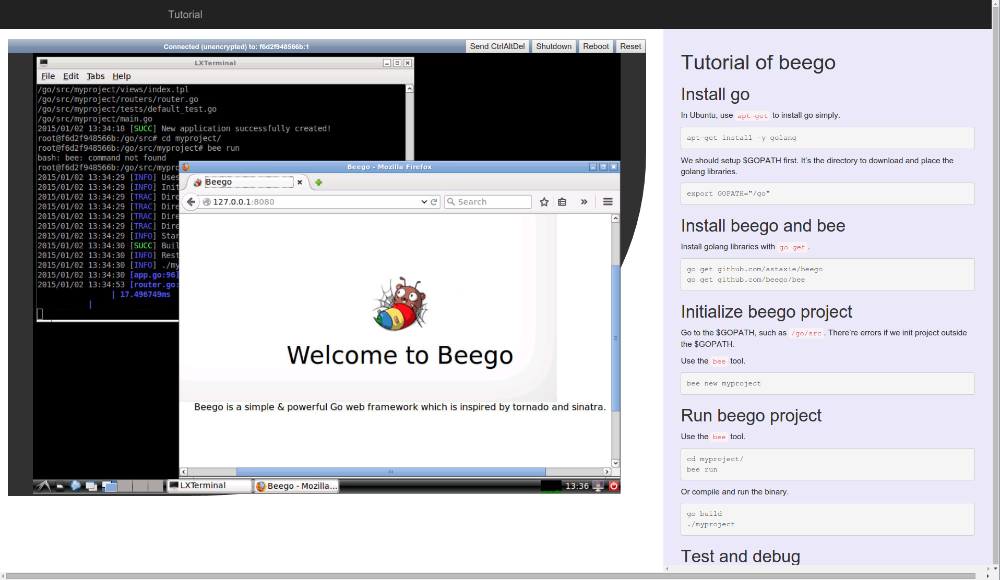

# Tutorial Beego

## Introduction

This is the practical tutorial of [beego](https://github.com/astaxie/beego/).

You can follow the processes one by one and know about the usage of beego framework.



## Usage

```
sudo docker run -d -p 6080:6080 tobegit3hub/tutorial-beego
```

Then go to <http://127.0.0.1:6080/vnc_auto.html>.

